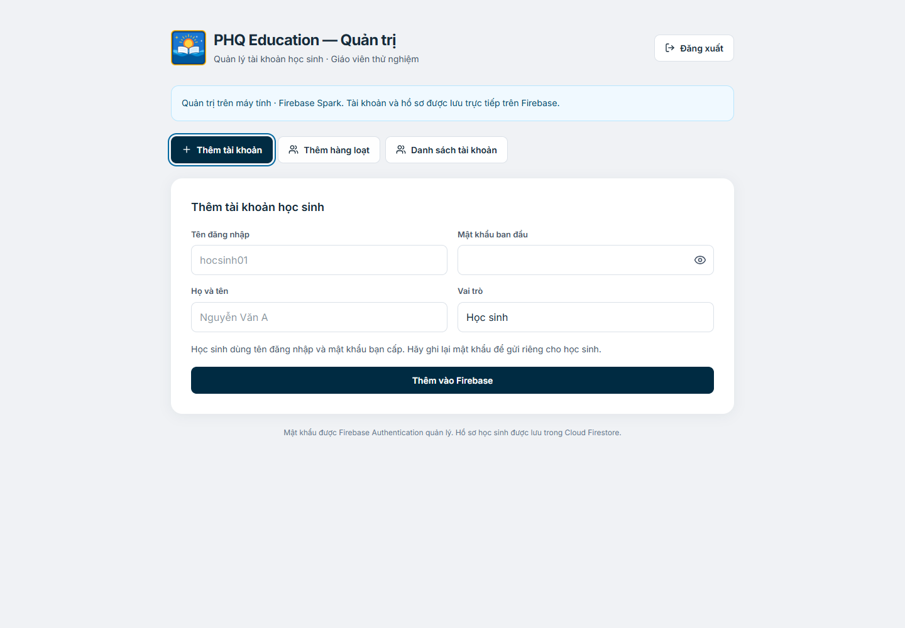

# gia-su-quang-pham-education

Website **PHQ Education / LumenPelagi®**: hero video, giao diện kính, đăng nhập học sinh, quản trị tài khoản bằng Firebase và bài tập trực tuyến chấm tự động.

**Website:** https://lumenpelagi.vercel.app/

Triển khai Vercel và kết nối dịch vụ: [docs/vercel.md](docs/vercel.md).


## Công nghệ

- React + TypeScript + Vite.
- Tailwind CSS v4, tích hợp qua plugin Vite.
- Các component Button và Dialog từ shadcn/ui, tùy chỉnh trên Radix UI.
- Instrument Serif và Inter (400/500) từ Google Fonts.

## Chạy trên máy

Cài Node.js 22.12 trở lên (khuyên dùng Node.js 24 LTS), sau đó:

Trên máy Windows hiện tại, có thể nhấp đúp **`chay-giao-dien.bat`** để mở giao diện. Tệp này hỗ trợ Node.js portable đã được tải cho dự án, hoặc Node.js có trên PATH.

```sh
npm install
npm run dev
```

Mở URL Vite hiển thị trong terminal, thường là `http://127.0.0.1:5173`.

```sh
npm run build      # Kiểm tra TypeScript và dựng bản production vào dist/
npm run preview    # Xem bản production trên máy
```

## Các tệp chính

- `src/App.tsx`: video, điều hướng, nội dung hero và thông báo đăng nhập.
- `src/pages/ExercisePage.tsx`: kho bài tập theo từng môn, tìm kiếm, danh mục, sắp xếp và mở trang làm bài.
- `src/components/QuizAdmin.tsx`: soạn đề, PDF/ảnh, đáp án, thời gian, xuất bản và kết quả học sinh.
- `src/components/QuizPlayer.tsx`: làm bài, tự lưu, đếm ngược, đánh dấu, điều hướng và nộp bài.
- `src/components/TuitionAdmin.tsx`: ghi buổi học, mức phí từng học sinh, thống kê theo tháng và QR ngân hàng.
- `worker/src/quiz-*.js`: xác thực, lưu đề/tệp trong D1 và chấm điểm phía máy chủ.
- `src/lib/subjects.ts`: các mục học tập và đường dẫn `bai-tap.html?mon=...`.
- `public/nen-dem-sao.html`: bản nền đêm sao từ tệp người dùng cung cấp; hiển thị phía sau trang bài tập.
- `src/index.css`: bảng màu HSL, hiệu ứng kính và animation fade-rise.
- `src/components/ui/`: các component shadcn/ui.
- `components.json`: cấu hình để thêm component shadcn/ui.

Video sử dụng trực tiếp URL CloudFront được cung cấp trong yêu cầu. Không có lớp phủ trang trí trên video. Có nút tạm dừng/phát; khi thiết bị bật giảm chuyển động, video được tạm dừng và animation được rút ngắn.

Các nút **Đăng nhập** dẫn đến [`dang-nhap.html`](https://phamhaiquang2003-sudo.github.io/gia-su-quang-pham-education/dang-nhap.html). Form dùng Authentication để xác thực và kiểm tra hồ sơ Firestore được giáo viên cấp. Quản trị viên vào `quan-tri.html`; học sinh quay về trang chủ video. Nút góc trên bên phải đổi thành **Đăng xuất** và đăng xuất trực tiếp; nút giữa trang hiển thị **Xin chào, [họ tên]**. Bấm lời chào để mở thông tin tài khoản. `hoc-sinh.html` cũng dùng giao diện trang chủ cho tài khoản đã đăng nhập. Ghi nhớ dùng persistence của Firebase và chỉ lưu tên đăng nhập trong localStorage, không lưu mật khẩu. Khi chưa đăng nhập, bấm Toán, Vật lý, KHTN, TSA/HSA/SPT hoặc Giải trí sẽ hiện hộp thoại nổi bật **“Bạn cần đăng nhập để tiếp tục”**, kèm nút **Đăng nhập ngay**. Với tài khoản đã đăng nhập, các mục này mở trang **`bai-tap.html?mon=...`**. Trang bài tập dùng nền đêm sao, các khung kính tối, tìm kiếm, lọc danh mục và sắp xếp; chưa có đề được đăng tải nên hiển thị **0 bài kiểm tra**, không có mục mức phí hay đề mẫu. Truy cập trực tiếp cũng phải có phiên đăng nhập hợp lệ.

## Bài tập trực tuyến

Trong `quan-tri.html` → **Bài tập**, giáo viên tạo đề bằng PDF/ảnh + phiếu trả lời hoặc soạn từng câu; hỗ trợ A/B/C/D, Đúng/Sai và trả lời ngắn. Có đặt thời gian, xem trước, lưu nháp, xuất bản, ẩn đề và xem kết quả. Đề xuất bản xuất hiện trong kho môn học; học sinh trả lời trực tiếp với đồng hồ, dấu cờ, bảng số câu và chấm tự động. Dữ liệu nằm trong Cloudflare D1 Free; Firebase tiếp tục dùng Spark. Xem [hướng dẫn tạo đề và quy tắc làm bài](docs/bai-tap-truc-tuyen.md).

## Firebase và quản trị học sinh

Trong trang quản trị, mục **Thống kê buổi học** ghi ngày học và phí từng buổi, lưu mức phí mặc định cho mỗi học sinh, tổng hợp số buổi/tổng học phí theo tháng và xuất PDF riêng cho từng em kèm QR MB Bank của giáo viên. Dữ liệu được lưu trên Cloudflare D1; xem [hướng dẫn ghi buổi học, học phí và xuất PDF](docs/buoi-hoc-hoc-phi.md).

Mục **Liên hệ gia sư** trên cả menu máy tính và điện thoại mở Zalo của Phạm Hải Quang tại **https://zalo.me/0365900419**, không yêu cầu đăng nhập.

Trang quản trị dựa theo mẫu: thêm từng tài khoản, xem danh sách, khóa/mở khóa, cấp lại mật khẩu và xóa học sinh. Mật khẩu thuộc Firebase Authentication; dữ liệu hồ sơ thuộc Firestore. **Dùng Firebase Spark miễn phí:** giáo viên thêm và xóa tài khoản ngay trên website công khai. Một phiên Auth riêng trong bộ nhớ giữ nguyên phiên giáo viên khi tạo; Firestore Rules kiểm tra quyền trước khi cấp hồ sơ. Chức năng xóa chạy trên **Cloudflare Workers miễn phí**, kiểm tra ID token, quyền quản trị và trạng thái tài khoản; xóa cả Auth, hồ sơ và giữ chỗ tên đăng nhập. Để khóa/mở khóa hoặc cấp lại mật khẩu, nhấp đúp `quan-tri-mien-phi.bat`. Website hoạt động khi bạn tắt máy. Xem [hướng dẫn dịch vụ Cloudflare](docs/cloudflare-admin.md).



**Hướng dẫn kích hoạt:** [docs/firebase-setup.md](docs/firebase-setup.md). Cấu hình Web của `phq-education` đã được tích hợp. Còn cần áp dụng Firestore Rules và tạo quản trị viên đầu tiên. Công cụ local dùng khóa Service Account lưu ngoài dự án; không cần triển khai Cloud Functions hay bật thanh toán. Cấu hình phát triển có thể được ghi đè bằng `VITE_FIREBASE_CONFIG`.

Form đăng nhập nằm trong thẻ xanh navy bo góc, có hiệu ứng kính, chữ sáng và ô nhập trong suốt đồng bộ với trang chủ. Phía sau là giao diện trang chủ cùng video được làm mờ. Nút **Quay lại** ở góc trên trái đưa về trang chủ.

Vite dùng `base: './'` để bản build có thể phục vụ dưới tiền tố kho GitHub Pages.

## Cập nhật website

GitHub Actions trong `.github/workflows/deploy-pages.yml` kiểm tra TypeScript, build React và triển khai thư mục `dist/` lên GitHub Pages mỗi khi đẩy mã lên `main`. Trong phần **Settings → Pages**, nguồn triển khai là **GitHub Actions**.
